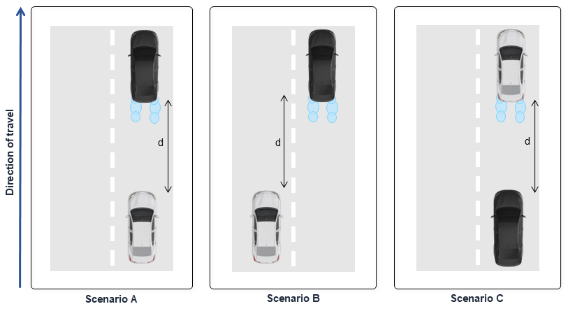

# SimRoadSpray dataset documentation

This page explains how the SimRoadSpray dataset is organized. The dataset is publicly available and can be downloaded in this link. [TODO LINK].

## Dataset strucutre

The dataset has the following folder structure:

```
SimRoadSpray
├── calib
├── cam_images
├── labels
├── scenes_filtered
└── scenes_full
```

Each one of these folders have subfolders for each scene of the dataset (there are a total of 25 scenes).

## Scenes configurations

The scenes were generated in three different scenarios (A, B, and C). Scenario A represents the following configuration: the ego vehicle travels behind a spray-generating target vehicle. Scenario B corresponds to a lateral overtaking configuration, in which the ego vehicle is exposed to spray generated by an adjacent vehicle. Scenario C represents a leading configuration in which the ego vehicle itself generates the spray affecting the LiDAR measurements.



Scenarios A and B were evaluated at target distances of 10, 20, and 30m, while Scenario C was evaluated at distances of 5 and 10m. Two target types were considered: a vehicle target, representing realistic traffic conditions, and a Lambertian surface target with 50% reflectivity. For each scenario and distance combination, static and paired dry and spray sequences were recorded under identical conditions and experimental settings.

| ID | Scenario | Condition | Distance | Folder name |
|---:|---|---|---:|---|
| 01 | Target | Dry | 10 m | `01_target_dry_10m` |
| 02 | Target | Spray | 10 m | `02_target_spray-1_10m` |
| 03 | Target | Spray | 10 m | `03_target_spray-2_10m` |
| 04 | Target | Dry | 20 m | `04_target_dry_20m` |
| 05 | Target | Spray | 20 m | `05_target_spray-1_20m` |
| 06 | Target | Spray | 20 m | `06_target_spray-2_20m` |
| 07 | Target | Dry | 30 m | `07_target_dry_30m` |
| 08 | Target | Spray | 30 m | `08_target_spray-1_30m` |
| 09 | Target | Spray | 30 m | `09_target_spray-2_30m` |
| 10 | Scenario A | Dry | 10 m | `10_scenario-a_dry_10m` |
| 11 | Scenario A | Spray | 10 m | `11_scenario-a_spray-2_10m` |
| 12 | Scenario A | Dry | 20 m | `12_scenario-a_dry_20m` |
| 13 | Scenario A | Spray | 20 m | `13_scenario-a_spray-2_20m` |
| 14 | Scenario A | Dry | 30 m | `14_scenario-a_dry_30m` |
| 15 | Scenario A | Spray | 30 m | `15_scenario-a_spray-2_30m` |
| 16 | Scenario B | Dry | 10 m | `16_scenario-b_dry_10m` |
| 17 | Scenario B | Spray | 10 m | `17_scenario-b_spray-2_10m` |
| 18 | Scenario B | Dry | 20 m | `18_scenario-b_dry_20m` |
| 19 | Scenario B | Spray | 20 m | `19_scenario-b_spray-2_20m` |
| 20 | Scenario B | Dry | 30 m | `20_scenario-b_dry_30m` |
| 21 | Scenario B | Spray | 30 m | `21_scenario-b_spray-2_30m` |
| 22 | Scenario C | Dry | 5 m | `22_scenario-c_dry_5m` |
| 23 | Scenario C | Spray | 5 m | `23_scenario-c_spray-2_5m` |
| 24 | Scenario C | Dry | 10 m | `24_scenario-c_dry_10m` |
| 25 | Scenario C | Spray | 10 m | `25_scenario-c_spray-2_10m` |

## Dataset folders

### `calib` folder

```
<scene_folder>
└── calib.json
```

For each scene a `calib.json` is given. This is necessary to project informations (such as 3D detections) into the camera images. Each JSON contain two matrices: `T_cam_lidar` to project points from LiDAR to camera, and `P` to project camera points into the image.

### `cam_images` folder

```
<scene_folder>
├── <image_1>.png
├── <image_2>.png
├── ...
└── <image_10>.png
```

For each scene 10 images were sampled. The filenames represent the data collection timestamp of the image.

### `labels` folder


### `scenes_filtered` and `scenes_full` folders

This repository contains the binary labeled point clouds collected from the indoor spray experiments. The dataset is organized in the structure bellow:

```
<scene_folder>
├── points/
│   ├── <xyz_intensity_pcd_1>.bin
│   ├── <xyz_intensity_pcd_2>.bin
│   └── ...
├── full_labels/
│   ├── <full_labels_1>.bin
│   ├── <full_labels_2>.bin
│   └── ...
└── spray_filter_labels/
    ├── <spray_filter_labels_1>.bin
    ├── <spray_filter_labels_2>.bin
    └── ...
```

Where each `scene_folder` contains the labeled point clouds of a specific scene. Each scene represents an experiment, with sequential frames (like a video) collected from it.

Each `scene_folder` contain **3** subfolders. These folders contain the binary files, each one being named with the timestamp of the data collection. Next, the **3** folders are explained in details:

1. The `points` folder: contains the original point clouds in the binary (`.bin`) format. These point clouds have the xyz coordinates and the intesity of each point in the point cloud (totalizing 4 columns). It is possible to read this file using `numpy`, as shown in the code snipet:

    ```
    np.fromfile(file_path, dtype=np.float32).reshape(-1, 4)
    ```

2. The `full_labels` folder: contains the original labels in the binary (`.bin`) format. It is one array containing the labeled point cloud using the original classes (background, target, car and spray). These labels can be used for data analysis. It is possible to read this file using `numpy`, as shown in the code snipet:

    ```
    np.fromfile(file_path, dtype=np.uint8)
    ```

3. The `spray_filter_labels` folder: contains the spray filter labels in the binary (`.bin`) format. It is one array containing the labeled point cloud using the not spray class (1 - car, target, background) and spray (0 - spray). This can be used to train models to learn how to filter out the water spray. It is possible to read this file using `numpy`, as shown in the code snipet:

    ```
    np.fromfile(file_path, dtype=np.uint8)
    ```